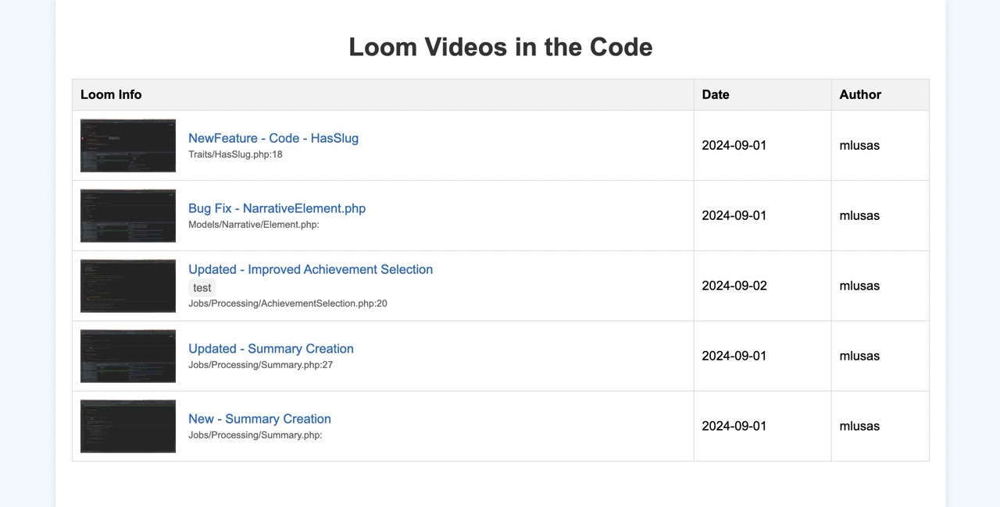

# Laravel Loom Updates

[](https://packagist.org/packages/mlusas/laravel-loom-updates)
[](https://packagist.org/packages/mlusas/laravel-loom-updates)
[](https://packagist.org/packages/mlusas/laravel-loom-updates)

## Who is this for?

Laravel Loom Updates is designed for Laravel developers who:
- Want to enhance their code documentation with video explanations
- Need to manage and track Loom videos used throughout their codebase
- Aim to improve onboarding processes for new team members
- Desire a centralized way to view and manage code-related video content

If you're using Loom to create video explanations for your code and want an easy way to manage these videos within your Laravel project, this package is for you!

[Jump to use cases](#use-cases)

## What is Laravel Loom Updates?

Laravel Loom Updates is a package that helps you track and manage Loom video links in your Laravel project's codebase. It provides tools to scan your code for Loom URLs, store them in a database, and display them in a user-friendly interface.

## Features

- Scan your Laravel project for Loom video URLs
- Option to see list of Loom videos in Command Line or Web Browser
- Store Loom video metadata in your database
- Display Loom videos in a clean, responsive interface
- Artisan commands for easy management of Loom URLs
- Configurable file scanning options

## Installation

You can install the package via composer:

```bash
composer require mlusas/laravel-loom-updates
```

After installation, run the migrations to create the necessary database table:

```bash
php artisan migrate
```

## Configuration

Publish the configuration file:

```bash
php artisan vendor:publish --provider="mlusas\LaravelLoomUpdates\LoomUpdatesServiceProvider" --tag="config"
```

This will create a `config/loom-updates.php` file where you can modify the package settings:

```php
return [
    'use_database' => true,
    'scan_directories' => [
        app_path(),
        resource_path(),
    ],
    'file_extensions' => ['php', 'js', 'ts', 'vue'],
];
```

- `use_database`: Set to `true` to store Loom URLs in the database, or `false` to only scan files without storing.
- `scan_directories`: An array of directories to scan for Loom URLs.
- `file_extensions`: An array of file extensions to scan for Loom URLs.

## Usage

### Adding Loom URLs to Your Code

You can add Loom URLs to your code using the following format:

```php
/**
 * @loom https://www.loom.com/share/your-video-id YYYY-MM-DD author "new Feature"
 */
```

- `YYYY-MM-DD`: The date the video was created
- `author`: The name of the person who created the video
- `tag`: A custom tag for categorizing the video (optional, enclosed in double quotes)

Example:
```php
/**
 * @loom https://www.loom.com/share/1234567890abcdef 2023-09-27 John.Doe "bug"
 */
class ComplexAlgorithm
{
    // ...
}
```

### Scanning for Loom URLs

To scan your project for Loom URLs and store them in the database (if `use_database` is true), run:

```bash
php artisan loom:store
```

### Listing Loom URLs

To list all Loom URLs found in your codebase, use:

```bash
php artisan loom:list
```

You can also filter by timeframe:

```bash
php artisan loom:list --timeframe=week
```
Timeframe options include:
- "day"
- "week"
- "month"

Note: This command will always scan your files in real-time. If `use_database` is set to `true`, it will also check the database for any stored URLs.

The output will include the URL, file path, line number, author, date, and tag for each Loom URL found.

### Viewing Loom Videos

To view the Loom videos in a web interface, add the following route to your `routes/web.php` file:

```php
Route::get('/loom-videos', function () {
    $loomUrls = \mlusas\LaravelLoomUpdates\Models\LoomUrl::all();
    return view('loom-updates::loom-viewer', compact('loomUrls'));
})->name('loom-videos');
```

Then visit `/loom-videos` in your browser.

*Tip: include the `loom:store` command in your CI/CD to scan, store, and show changes when pushed to staging or production.*

Here's a preview of what the Loom viewer interface looks like:



## Use Cases

1. **Code Documentation**: Explain complex parts of your codebase with Loom videos.
2. **Onboarding New Developers**: Help new team members understand the codebase quickly.
3. **Feature Demonstrations**: Demonstrate new features or changes in the project.
4. **Bug Reporting**: Visually report and explain bugs in the system.
5. **Code Review Explanations**: Provide detailed explanations for code reviews.
6. **Architecture Overviews**: Give high-level explanations of system architecture.

[Back to top](#laravel-loom-updates)

## Contributing

Contributions are welcome! Please see [CONTRIBUTING.md](CONTRIBUTING.md) for details.

### Testing

```bash
composer test
```

## Security

If you discover any security-related issues, please email security@example.com instead of using the issue tracker.

## Credits

- [Mitch Lusas](https://github.com/mlusas)
- [All Contributors](../../contributors)

## License

The GNU General Public License v3.0 (GPLv3). Please see [License File](LICENSE.md) for more information.